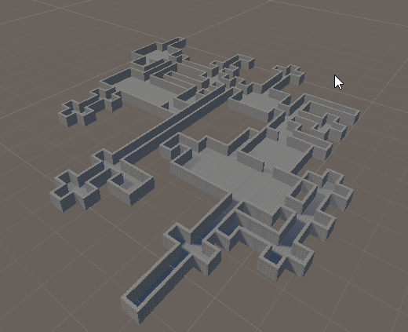

# RPG-Dungeon-Generator

The dungeon generator uses text files like these. The $ represent points where tiles can be connected together.

```
+----$----------+
|. . . . . . . .|
|               |
|. . . . . . . .$
|               |
$. . . . . . . .|
|               |
|. . . . . . . .|
+------------$--+
```

```
  +$+
  |.|
+-+ +-+
$. . .$
+-+ +-+
  |.|
  +$+
```

```
+-----+
$. . .$
+-+ +-+
  |.|
  +$+
```

At the end of the day, you write "Generation Tables" that look similar to the code in this screenshot. Ideally, I would like to have Nested generation tables and $ connection points that have generation tables within them.


The output of the Generate method produces something similar to this:


Using the GridEditor window, you can specify how each symbol should be translated to a set of Unity prefabs resulting in something like this:



Lastly, we wrote a very simple script to walk about in playmode: [Video](imgs/Video.mp4)
